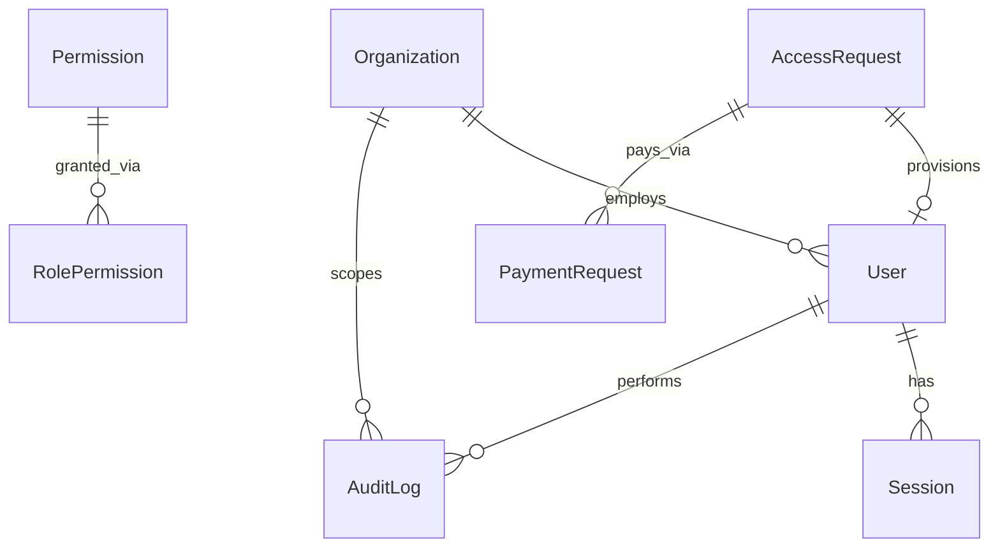
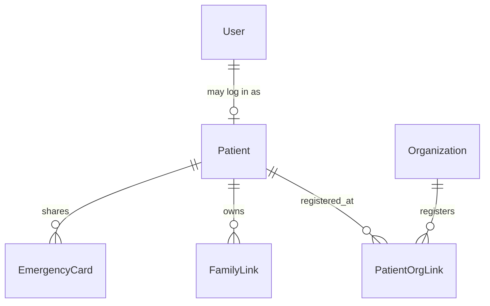
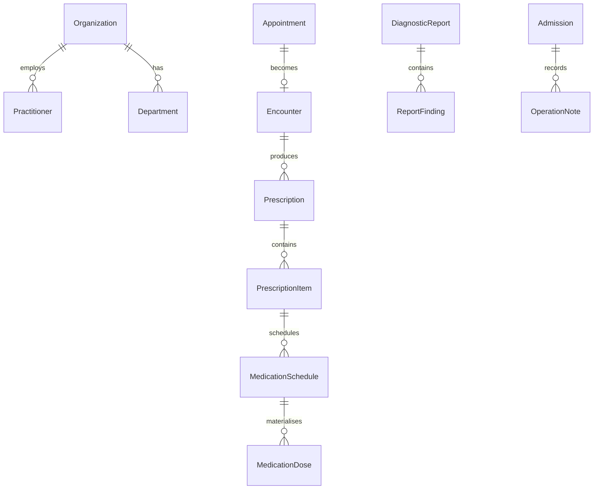
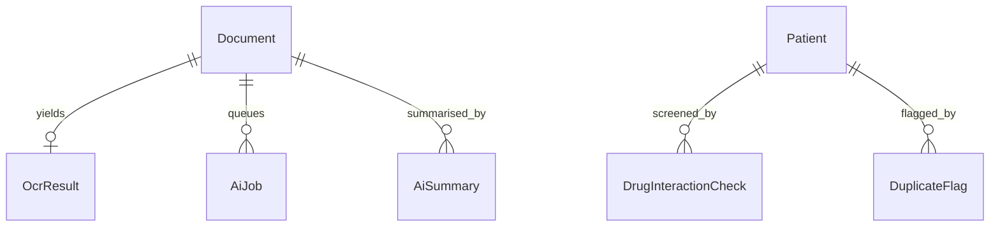
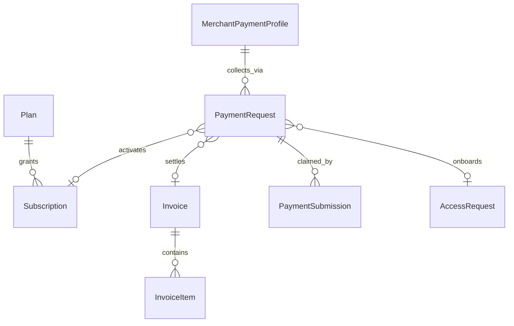
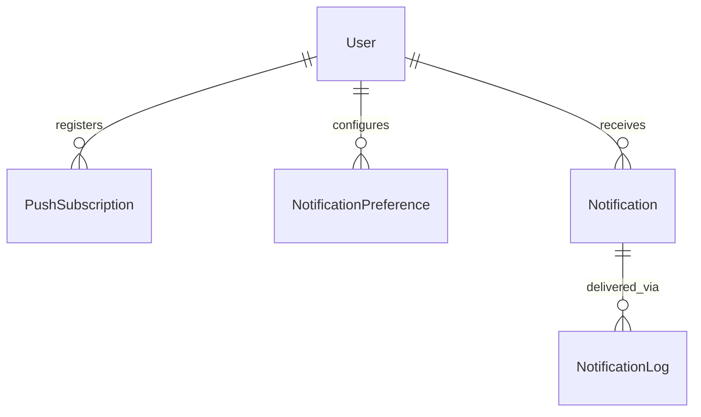
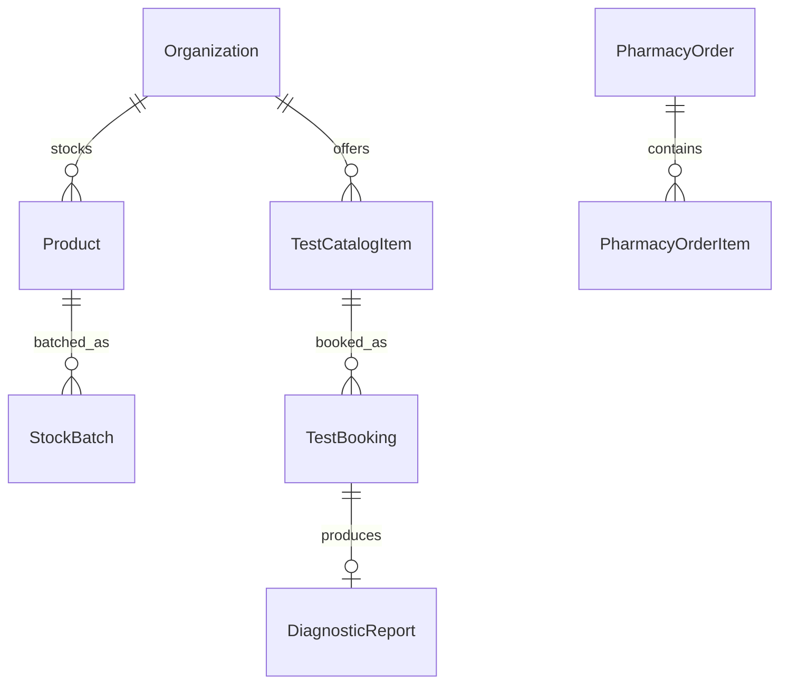

# Data model

Entity-relationship description of `prisma/schema.prisma`. Six domains, ~45
models. Enum values live in [`src/shared/enums.ts`](../src/shared/enums.ts) and
are mirrored exactly in Prisma.

## Cross-cutting rules

| Rule | How it shows up |
| --- | --- |
| **Tenancy** | Provider-owned rows carry `orgId`. Patient data is scoped through `PatientOrgLink` — a clinic sees a patient only if a link exists. Never trust a client-supplied id. |
| **Soft delete** | Medical and financial models have `deletedAt`; every query filters `deletedAt: null`. `AuditLog` has none — it is append-only. |
| **Money** | Always `Int` in the minor unit (paise), suffixed `Minor`. Never a float. |
| **Encryption** | Columns suffixed `Enc` are AES-256-GCM ciphertext via [`src/lib/crypto.ts`](../src/lib/crypto.ts): UPI VPA, bank account, IFSC, insurance policy number, ABHA id, TOTP secret. |
| **AI provenance** | AI-derived rows carry `aiProvider` / `aiModel` / `aiConfidence` and a `confirmedAt`. Anything below the confidence threshold must be confirmed by a human before it is treated as fact. |

## Identity

- **Organization** — the tenant. `type` is CLINIC / HOSPITAL / DIAGNOSTIC_CENTRE /
  PHARMACY / PLATFORM.
- **User** — a login. Always created by an admin: `mustChangePassword` starts true,
  there is no self-registration and no email anywhere. `failedLoginCount` and
  `lockedUntil` back the Phase 2 lockout.
- **Permission / RolePermission** — the RBAC catalogue, seeded from
  [`src/shared/permissions.ts`](../src/shared/permissions.ts). Deny-by-default: no
  row means no access. Re-seeding *revokes* permissions removed from the code.
- **Session** — stores only a SHA-256 of the refresh token, so a leaked database
  cannot be replayed as a login, and one session can be revoked without rotating
  the global JWT secret.
- **AccessRequest** — a prospect with no account. Flows
  PENDING → AWAITING_PAYMENT → APPROVED → PROVISIONED, the last step linking to the
  `User` a Super Admin created. Credentials are handed over out-of-band.

## Patient

- **Patient** — a person. Deliberately separable from `User`: a clinic can register
  a walk-in and a child may never have a login.
- **PatientOrgLink** — the tenancy join, carrying the provider's own `mrn`
  (unique per org).
- **FamilyLink** — a *directed* edge `owner → member` with `relationship` and
  `accessLevel` (VIEW / MANAGE). Asymmetry is intentional: Priya managing her
  child's record does not let the child manage hers. Two rows make it mutual.
- **EmergencyCard** — an unguessable `shareToken` behind a QR, with per-section
  opt-in and a view counter. Rotating the token revokes every printed copy.

## Clinical

- **Appointment → Encounter** — booking and visit are separate: an encounter can
  happen without a booking (walk-in), and a booking can end NO_SHOW.
- **Prescription** — `orgId` and `practitionerId` are nullable, because a
  prescription may come from a patient's *upload* structured by the AI pipeline
  rather than from a provider in the system. `prescriberName` covers that case.
- **MedicationDose** — expected doses are materialised rows, unique on
  `(scheduleId, dueAt)`. That uniqueness is what makes a redelivered QStash
  reminder idempotent, and it is what adherence reporting counts.
- **DiagnosticReport** — `status` runs ORDERED → … → PUBLISHED, with
  `verifiedById` / `verifiedAt` for the Phase 9 sign-off.

## Documents & AI

- **Document** — a row is created *before* the upload (`PENDING_UPLOAD`) so a
  presigned PUT always has something to attach to and orphaned objects are
  detectable. `storageKey` is an R2 key, never a public URL.
- **AiJob** — one unit of async work. `qstashMessageId` is unique, which is the
  idempotency key when QStash redelivers.
- **DrugInteractionCheck** — persisted rather than computed on the fly, because
  `acknowledgedAt` makes dismissing a drug warning an auditable clinical event.

## Commerce — manual payments, no gateway

The collect-and-verify flow (Phase 6):

1. **PaymentRequest** is raised with a short `refCode` — uppercase alphanumeric and
   deliberately not a cuid, because it is embedded in the UPI deep link's `tr`
   parameter, which several UPI apps truncate.
2. The payer is shown a QR, a `upi://pay?…` deep link, or bank details from
   **MerchantPaymentProfile** (all identifiers encrypted).
3. The payer pays *outside the platform*, then files a **PaymentSubmission** with
   the `utr`. **`utr` is globally unique**, not unique per request: an Indian bank
   reference identifies exactly one real transfer, so reuse across different
   requests is the fraud case.
4. An admin approves → the linked `Invoice` is marked PAID, or the `Subscription`
   activates, or the `AccessRequest` moves to provisioning.

`PaymentRequest` points at exactly one of invoice / subscription / accessRequest,
which is what lets one flow serve consumer subscriptions, provider→patient
billing, and pre-account onboarding.

- **Plan.features** is JSON (`{ familyMembers, aiPagesPerMonth, storageMb, … }`),
  read by the entitlement guard. Adding an entitlement is a seed change, not a
  migration.
- **Expense** is independent of `Invoice` — most Indian health spend never touches
  a platform invoice, and the patient still wants it on the timeline.

## Notify — web push + in-app only

`NotificationChannel` is IN_APP, WEB_PUSH or **WHATSAPP_MANUAL**. The last one
records that an operator copied the message by hand. The audit trail is identical
whether a human or an adapter sent it — which is precisely what makes the later
Meta Cloud API adapter a drop-in with no changes elsewhere. There is no email
channel and no SMS channel, by design.

## Ops — pharmacy and diagnostics

Stock is tracked per **StockBatch** (`batchNo`, `expiryAt`) rather than per
product, because expiry alerts and recalls are batch-level facts. `TestBooking`
links one-to-one to the `DiagnosticReport` it produced, closing the loop from
booking to a result on the patient's timeline.

## Seeded data

`pnpm db:seed` is idempotent — every write is an upsert on a stable key, and demo
rows use fixed `demo-*` ids.

| | |
| --- | --- |
| Reference | 53 permissions × 12 roles; 4 plans (2 patient, 2 provider) |
| Tenants | platform + one each of clinic, hospital, diagnostic centre, pharmacy |
| Demo family | Priya (owner) → Aarav CHILD/MANAGE, Sunita PARENT/MANAGE, Rahul SPOUSE/**VIEW** |
| Registrations | Priya + Aarav at the clinic; Sunita at the hospital |

The VIEW-only spouse link and the split registration are not decoration — they are
what the tenant-isolation and family-access tests in
[`tests/data-model.integration.test.ts`](../tests/data-model.integration.test.ts)
assert against.

No user accounts are seeded by default. Use `pnpm db:seed -- --demo-users` for
demo logins with generated passwords (refused when `NODE_ENV=production`), or
`pnpm create-super-admin --username <name>` for a real one.
